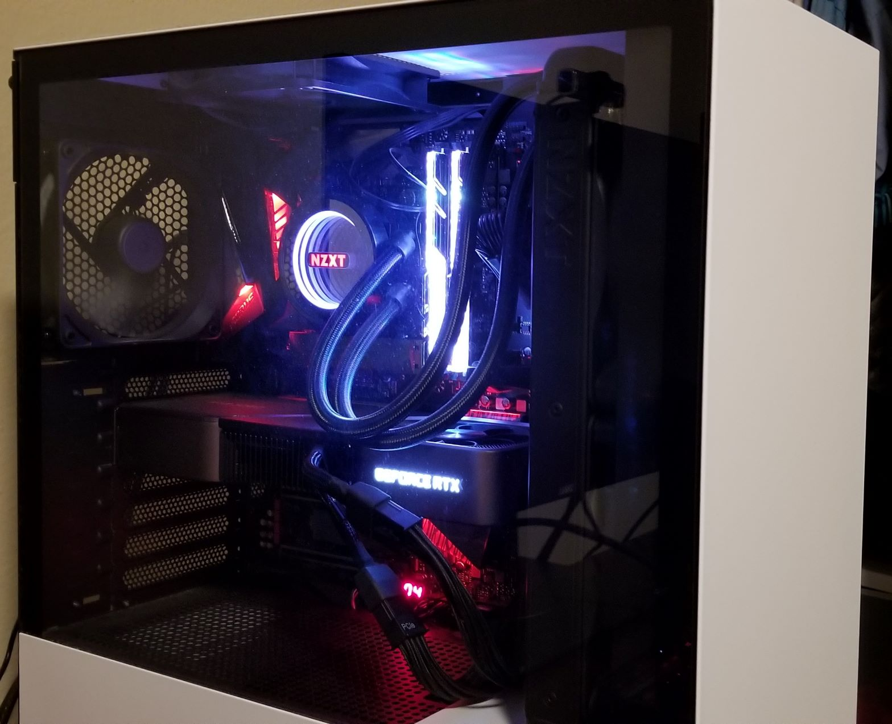

## About Me

Hey! Welcome to my [page](index.md). I'm a undergraduate Computer Science student at *UC San Diego* where I will be **graduating in _2023_**. My interests include **Web Devlopment**, **Data Structures**, and **Systems Programming**. I also especially enjoy creating software for ***social good***. While you're here, make sure to read about some of my [Projects](#some-projects), a [ranking](#my-favorite-classes-so-far-ranked) of my favorite classes at UCSD, and a fun [fact](#fun-fact-about-c) about C++. Also, check out my [Linkedin](https://www.linkedin.com/in/nirmal-agnihotri-29372a1a5/).

### Current Learning Goals
- [x] ~Learn some basic Markdown~
- [ ] Learn a database language, specifically SQL
- [ ] Use and learn more about MongoDB
- [ ] Practice Javascript, especially the REACT framework
- [ ] Create a useful project using Python

### Some Projects
1. Feeding San Diego
   - Part of a 7 person team creating a user friendly web app to help Feeding San Diego manage food distribution. The app allows the user to update, search, and view large amounts of information in an organized manner while being far more UI friendly than a massive excel spreadsheet. Project uses the MERN stack. I am currently using REACT to creat front-end elements such as the navbar and info table and using Mongo to manage and create the database.
2. United Women of East Africa Kitchen Website
   - Worked with a 5 person team to create a website where customers of the United Women of East Africa kitchen service are able to order food. Worked with Mongo, JQuery, CSS and HTML to create cart functionality and a user-friendly table to manage a large database of orders.
3. AP US History Review App
   - Created a Java Application in high school to help students prepare for the AP US History Exam. The application featured simple UI and would add additional information upon correct answers to help contextualize information.

### My favorite classes so far, Ranked
1. Computer Architecture and Systems Programming
2. Discrete Math
3. Advanced Data Structures
4. Theory of Computation
5. Linear Algebra

### Some Fun Info
#### My favorite Quote
In a speech at the University of Cape Town in Soth Africa, Roberty Kennedy declared:

> Some men see things as they are and say, why; Others dream things that never were and say, why not.

#### Fun fact about C++
A small but interesting fact about C++ has to do with array access.

Code Snippet 1:
```
int arr[4] = {50, 51, 52, 53};
int toPrint = arr[2];
std::cout << toPrint << std::endl;
 ```
 Code Snippet 2:
 ```
 int arr[4] = {50, 51, 52, 53};
 int toPrint = 2[arr];
 std::cout << toPrint << std::endl;
 ```
 Interestingly both snippets will print the same thing, 52. This is because in compilation arr[2] will become *(arr + 2) and 2[arr] would just become *(2 + arr). Both are equivalent, but arr[2] is certainly nicer.

#### Favorite Hobby
 One of my favorite hobbies is building PC's! I love learning about hardware, its why Computer Architecture was one of my favorite [classes](https://github.com/NirmalAgnihotri/NirmalAgnihotri.github.io/blob/main/index.md#my-favorite-classes-so-far-ranked) and I hope to learn more in the future! Here's a [pic](currentBuildMid.png) of my current build after some recent upgrades:

 
